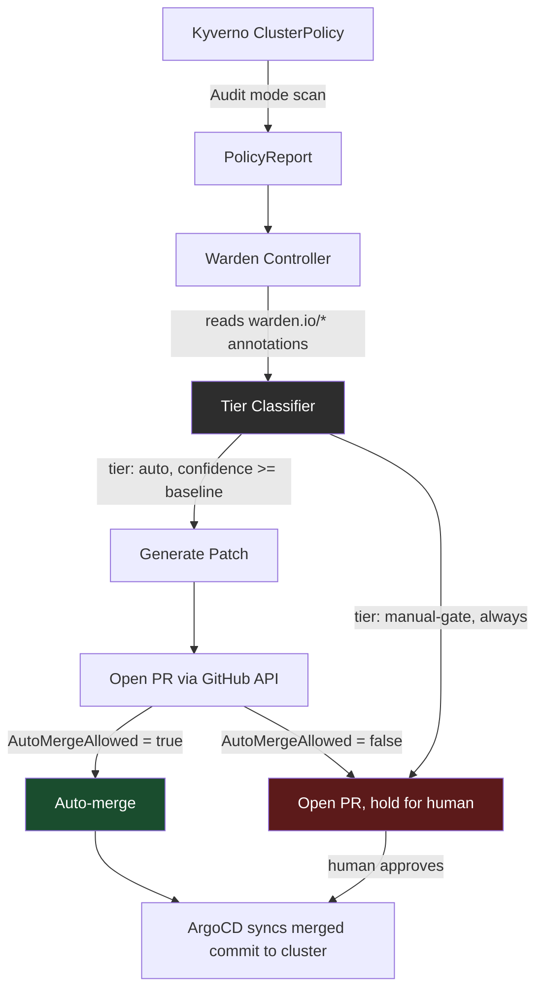

# Warden

**Closed-loop Kubernetes policy remediation with a hard-gated autonomy boundary.**

[](go.mod)
[](https://kyverno.io)
[](controller)
[](LICENSE)

Most policy tools stop at detection. Kyverno and OPA flag a violation. A scanner reports it. A human still has to read it, judge the risk, and merge the fix. That creates a backlog that grows faster than review capacity.

Warden classifies every violation into a confidence-gated autonomy tier, generates the fix, and opens a real, auditable pull request. Low-risk violations can auto-merge through the normal GitOps pipeline. High-risk violations open a PR and stop there, unconditionally, regardless of confidence score.

## Why not Kyverno's own mutate policies?

Kyverno can already patch live cluster objects at admission time. That fixes the **cluster**, not the **git source**, and breaks the single-source-of-truth model every GitOps setup depends on. Warden fixes the git source and merges through the normal pull request pipeline. Git stays authoritative. The cluster only changes because a commit changed.

## Architecture



The tier classifier (`controller/internal/remediation/tier.go`) is the safety-critical piece. `TestManualGateNeverAutoMerges` sweeps confidence from 0.0 to 1.0 and asserts a manual-gate policy can never return `AutoMergeAllowed = true`, at any score. That boundary is enforced in code, not in a comment.

## Status

| Component | State |
|---|---|
| Kyverno ClusterPolicies (`require-resource-limits`, `restrict-prod-network-policy-bypass`) | Verified end-to-end on kind and on Azure AKS |
| Tier classifier | 7/7 tests passing, `go vet` and `gofmt` clean |
| PolicyReport watcher | Compiles, no unit tests yet (real gap, tracked, not hidden) |
| Resource-limits patch generator | 7/7 tests passing against real manifests |
| GitHub PR automation + auto-merge gate | Compiles, wired into the controller, dry-run by default |
| Full end-to-end run against a live cluster with a real GitHub token | Not yet executed, next verification step |

Nothing in this table is aspirational. If a row says "not yet," it means exactly that.

## Quickstart

```bash
# 1. Local cluster
kind create cluster --name warden-dev

# 2. Install Kyverno (server-side apply avoids a known CRD annotation-size limit)
kubectl apply --server-side -f https://github.com/kyverno/kyverno/releases/download/v1.12.0/install.yaml
kubectl wait --for=condition=Ready pods --all -n kyverno --timeout=180s

# 3. Apply the policies and a sample violation
kubectl apply -f manifests/policies/
kubectl apply -f manifests/violations/no-resource-limits.yaml

# 4. Confirm the violation is flagged
kubectl get policyreport -A -o yaml

# 5. Run the controller in dry-run mode (default, opens zero PRs, logs only)
cd controller/cmd/warden
go run .
```

To run live (opens real PRs, auto-merges when the classifier allows it):

```bash
export WARDEN_GITHUB_TOKEN=ghp_xxx
go run . -dry-run=false -repo-owner=EdwinJdevops -repo-name=warden
```

## Repo layout

```
warden/
├── manifests/
│   ├── policies/       Kyverno ClusterPolicies
│   ├── violations/      sample non-compliant workloads
│   └── compliant/       target state after remediation
├── controller/
│   ├── cmd/warden/      entrypoint, CLI flags, main loop
│   └── internal/
│       ├── watcher/      PolicyReport + ClusterPolicy fetching
│       ├── remediation/  tier classifier (safety boundary)
│       └── gitops/       patch generation + PR automation
├── terraform/            one-time AKS cloud-portability proof, destroyed after each run
└── docs/
    └── ARCHITECTURE.md
```

## Design decisions worth reading

- **Deterministic confidence scoring, not an LLM call.** The resource-limits fix has exactly one correct shape. A model call here would be theater. See `docs/ARCHITECTURE.md`.
- **Ephemeral cloud infrastructure.** The AKS proof-run is provisioned, verified, and destroyed the same session. Idle cloud spend with no offsetting purpose is a FinOps failure, not a demonstration of cloud skill.
- **Two struct types for policy annotations** (`watcher.PolicyAnnotationsRaw` and `remediation.PolicyAnnotations`), converted explicitly at the package boundary. Avoids a cross-package dependency for a shared shape.

## License

MIT, see [LICENSE](LICENSE).

## Author

Built by **Edwin Jonathan** ([@EdwinJdevops](https://github.com/EdwinJdevops)), Cloud/DevOps engineer.

LinkedIn: _add link_
Upwork: _add link_
