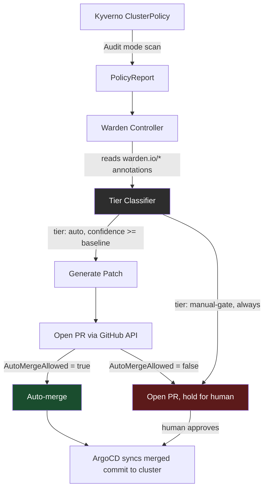

```
 __      __             __
/  \    /  \_____ _____/  |_  ____   ____
\   \/\/   /\__  \\__  \   __\/ __ \ /    \
 \        /  / __ \/ __ \|  | \  ___/|   |  \
  \__/\__/  (____  (____  /__|  \___  >___|  /
                 \/     \/          \/     \/
```

**Closed-loop Kubernetes policy remediation with a hard-gated autonomy boundary.**

[](go.mod)
[](https://kyverno.io)
[](controller)
[](LICENSE)

## The problem with every policy engine you already run

Kyverno and OPA Gatekeeper will tell you a workload is broken. They will not fix it. A scanner adds the violation to a dashboard. A human has to open it, understand the blast radius, and merge a fix by hand. In a cluster with hundreds of policies and thousands of workloads, that backlog grows faster than any team can review it. Most organizations respond by muting the noisy rules. That is not a security posture, it is a coping mechanism.

The other available answer, Kyverno's own `mutate` policies, patches the live object in the cluster at admission time. That closes the gap for exactly one object, once, and it does so by writing directly to the API server, bypassing git. The moment that happens, your Deployment's manifest in git no longer matches what is actually running. GitOps stops being a source of truth and becomes a suggestion.

## What Warden does differently

Warden treats the git repository as the only thing allowed to change cluster state. When Kyverno flags a violation, Warden reads a declared trust level directly off the policy, computes whether the specific fix qualifies for that trust level, and only then acts:

- **Auto tier.** Deterministic, low-blast-radius fixes (a missing `resources` block, for example, has exactly one correct shape) get a generated pull request that merges automatically once confidence clears the policy's declared baseline.
- **Manual-gate tier.** Anything touching network policy, RBAC, or a production namespace opens a pull request and stops there. Permanently. Not "usually." The test suite enforces this: `TestManualGateNeverAutoMerges` sweeps confidence from 0.0 to 1.0 and asserts the merge boundary holds at every value, so a future contributor cannot accidentally wire auto-merge into a tier that was never supposed to have it.

The result is an audit trail that answers the question every security review eventually asks: why did this change happen, and who, or what, decided it was safe.

## Why this, not a scanner, not a Slack bot, not another dashboard

| | Kyverno mutate | Trivy / Kubescape | Warden |
|---|---|---|---|
| Detects violations | Yes | Yes | Yes |
| Fixes the live cluster | Yes, directly | No | No, deliberately |
| Fixes the git source | No | No | Yes |
| Keeps git authoritative | No | N/A | Yes |
| Graduated trust by blast radius | No | No | Yes |
| Provable ceiling on auto-merge scope | N/A | N/A | Yes, tested |

If your team already trusts Kyverno to detect violations, Warden is the missing half: what happens after detection, decided by policy, not by whoever is on call.

## Architecture



## Status

| Component | State |
|---|---|
| Kyverno ClusterPolicies (`require-resource-limits`, `restrict-prod-network-policy-bypass`) | Verified end-to-end on kind and on Azure AKS |
| Tier classifier | 7/7 tests passing, `go vet` and `gofmt` clean |
| PolicyReport watcher | Compiles, no unit tests yet, tracked as an open gap, not hidden |
| Resource-limits patch generator | 7/7 tests passing against real manifests |
| GitHub PR automation + auto-merge gate | Compiles, wired into the controller, dry-run by default |
| Full end-to-end run against a live cluster with a real GitHub token | Not yet executed, the next verification step |
| CLI packaging (`go install`, cross-platform release binaries) | This release |
| VS Code extension | Scoped, not started, see Roadmap |
| Hosted dashboard | Scoped, not started, see Roadmap |

If a row says "not yet," it means exactly that. Nothing here is rounded up.

## Install

```bash
go install github.com/EdwinJdevops/warden/controller/cmd/warden@latest
```

Or build from source:

```bash
git clone https://github.com/EdwinJdevops/warden.git
cd warden
make build
./bin/warden -h
```

Cross-platform release binaries (Linux, macOS, Windows) are produced via the included `.goreleaser.yml`, run `goreleaser release` from a tagged commit to publish them.

## Quickstart

```bash
kind create cluster --name warden-dev

kubectl apply --server-side -f https://github.com/kyverno/kyverno/releases/download/v1.12.0/install.yaml
kubectl wait --for=condition=Ready pods --all -n kyverno --timeout=180s

kubectl apply -f manifests/policies/
kubectl apply -f manifests/violations/no-resource-limits.yaml
kubectl get policyreport -A -o yaml

warden -dry-run=true
```

Live mode, opens real PRs, auto-merges when the classifier allows it:

```bash
export WARDEN_GITHUB_TOKEN=ghp_xxx
warden -dry-run=false -repo-owner=EdwinJdevops -repo-name=warden
```

## Repo layout

```
warden/
├── manifests/
│   ├── policies/       Kyverno ClusterPolicies
│   ├── violations/      sample non-compliant workloads
│   └── compliant/       target state after remediation
├── controller/
│   ├── cmd/warden/      entrypoint, CLI flags, main loop
│   └── internal/
│       ├── watcher/      PolicyReport + ClusterPolicy fetching
│       ├── remediation/  tier classifier, the safety boundary
│       └── gitops/       patch generation + PR automation
├── terraform/            one-time AKS cloud-portability proof, destroyed after each run
└── docs/
    └── ARCHITECTURE.md
```

## Design decisions worth reading before you file an issue

- **Deterministic confidence scoring, not a model call.** The resource-limits fix has exactly one correct shape. Calling an LLM to compute a number that a rule already computes deterministically is not intelligence, it is added latency and an unnecessary failure mode. See `docs/ARCHITECTURE.md`.
- **Ephemeral cloud infrastructure for proof runs.** The AKS validation is provisioned, verified, and destroyed the same session. Idle cloud spend with no offsetting purpose is a FinOps failure, not evidence of cloud skill.
- **Two structurally identical annotation types across package boundaries.** `watcher.PolicyAnnotationsRaw` and `remediation.PolicyAnnotations` are converted explicitly at the call site rather than sharing a type across packages, so the safety-critical `remediation` package has zero dependency on how Kubernetes objects happen to be fetched.

## Roadmap

- End-to-end run against a live cluster with a real GitHub token and a real merged PR, captured as evidence
- Unit tests for `watcher`
- VS Code extension surfacing PolicyReport violations and their tier inline in the editor, not started, scoped as a separate TypeScript codebase with its own test suite
- Hosted audit-trail dashboard (Postgres-backed API plus a minimal frontend), not started, scoped as a separate service

## Contributing

Issues and pull requests are welcome. Read `docs/ARCHITECTURE.md` first, especially the section on why confidence scoring is deterministic here, before proposing an AI-driven alternative.

## License

MIT, see [LICENSE](LICENSE).

## Author

Built by **Edwin Jonathan**, Cloud/DevOps engineer.

- GitHub: [@EdwinJdevops](https://github.com/EdwinJdevops)
- X: [@TheCloudDeveng](https://x.com/TheCloudDeveng)
- LinkedIn: [edwin-jonathan](https://www.linkedin.com/in/edwin-jonathan-1094093b0)
- Hashnode: [@jonathandevops](https://hashnode.com/@jonathandevops)
- Dev.to: [@edwindevops](https://dev.to/edwindevops)
- Email: edwinjonathanchibuike123@gmail.com
